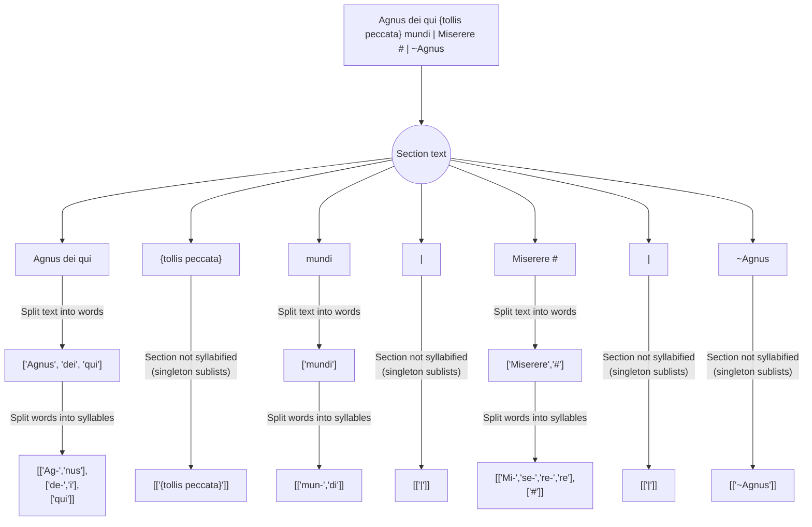

# volpiano-display-utilities

This repository provides a set of modules for the syllabification of latin chant texts and the alignment of chant texts with volpiano according to the conventions of Cantus Database. 

The respository consists of three main utilities:
1. A tool (`cantus_text_syllabification.syllabify_text`) that parses text and syllabifies it for display with a melody. This tool assumes that input text conforms to Cantus Database specifications for text entry, including handling of incipits, text division, and missing text or music.
2. A tool (`latin_word_syllabification.syllabify_word`) that splits latin words into syllables based on linguistic rules. This tool could theoretically be used to syllabify latin words from any latin text, whether or not it is transcribed according to Cantus Database specifications. 
3. A tool (`text_volpiano_alignment.align_text_and_volpiano`) that aligns a chant's text and volpiano together for display in the browser. The tool includes basic handling of misalignments due to encoding errors. 

## Requirements

The module requires python >= 3.8.

## Text Syllabification

`syllabify_text` parses a chant text encoded to Cantus Database specifications for display with a melody. A brief overview of Cantus Database encoding conventions can be found below or at www.cantusdatabase.org/documents. 

```python
>>> from cantus_text_syllabification import syllabify_text
>>> syllabify_text("Agnus dei qui {tollis peccata} mundi | Miserere # | ~Agnus")
'[SyllabifiedSection: [["Ag-","nus"], ["de-","i"], ["qui"]], SyllabifiedSection: [["{tollis peccata}"]], SyllabifiedSection: [["mun-","di"]], SyllabifiedSection: [["|"]], SyllabifiedSection: [["Mi-","se-","re-","re"], ["#"]], SyllabifiedSection: [["|"]], SyllabifiedSection: [["~Agnus"]]]'
>>> syllabify_text("Glori@ patr1 &t")
'ValueError: ...' # Input with invalid characters will raise a value error. 
```

The function returns a list of SyllabifiedTextSection objects, with one SyllabifiedTextSection object per section of the chant text. Sections are created in the chant text at pipes ("|") or when a substring of the chant text should not be syllabified (eg. when it corresponds to missing music -- these are detailed below). Each SyllabifiedTextSection object has a "section" attribute that contains the syllabification of that section, along with some methods for easy navigation of the section. This syllabification consists of a list of lists:
 - each element of the outer list is a word (for sections where syllabification is necessary) or a list with one element for the whole section (for sections where syllabification is not necessary)
 - each element of the inner list is  is a list of syllable strings (if the word needs to be syllabified)



A SyllabifiedTextSection's `flatten_to_str` method flattens a section's contents to a string. The `flatten_syllabified_text` function flattens a list of SyllabifiedTextSections to a single string.

```python
>>> syllabified_text = syllabify_text("Agnus dei qui {tollis peccata} mundi | Miserere # | ~Agnus")
>>> syllabified_text[0]
'SyllabifiedSection: [["Ag-","nus"], ["de-","i"], ["qui"]]'
>>> syllabified_text[0].flatten_to_str()
"Ag-nus de-i qui"
>>> from cantus_text_syllabification import flatten_syllabified_text
>>> flatten_syllabified_text(syllabified_text)
'Ag-nus de-i qui {tollis peccata} mun-di | Mi-se-re-re # | ~Agnus'
```

Cantus Database allows users to edit the syllabification of a chant text created by the automatic syllabification tool in cases where the automatic syllabification is incorrect, where some misalignment between text and melody exists in the manuscript (eg. a word with two syllables has only one pitch in the manuscript), or any other case where a syllabification of the text different than the default syllabification is preferred. These are stored as strings with syllable boundaries marked by hyphens ("-"). Argument `text_presyllabified` (default = False) allows presyllabified texts to be passed in preparation for alignment with a melody. 

```python
>>> syllabify_text("Ky-ri-e e-le-i-son | Chri-ste e-lei-son", text_presyllabified = True)
'[[["Ky-","ri-","e"], ["e-","le-","i-","son"]], [["|"]], [["Chri-","ste"], ["e-","lei-","son"]]]'
```

Aligning chant texts with melodies requires most words in the chant to be syllabified; however, there are a number of cases in which subsets of chant texts are not syllabified: 
 1. Chant text is missing. Missing chant text is encoded with "#" and is aligned with volpiano but not syllabified.
 2. Music is missing. Text associated with missing music is enclosed within curly braces ("{" and "}"). It is aligned with a section of blank staff but is not syllabified.
 3. The chant text includes an incipits. Incipits are prefixed by a tilde ("~") and/or enclosed in square brackets ("[","]"). These are aligned with music for the incipt but are not syllabified. 

More details about text entry in Cantus Database can be found at https://cantusdatabase.org/documents

### Alignment Logic

Text and volpiano are first aligned section by section and then word by word in order to handle cases of overflow as locally as possible and minimize the extent to which minor encoding errors cascade through the entire chant. These are handled as follows:

- *Word has more volpiano syllables than text syllables*: display "extra" volpiano aligned with blank syllables ("") in the text
- *Word has more text syllables than volpiano syllables*: display "extra" text syllables aligned with blank staff space ("-") in volpiano
- *Section has more volpiano words than text words*: display "extra" volpiano at end of section aligned with blank words ("") in text for spacing
- *Section has more text words than volpiano words*: display "extra" words at end of section aligned with blank staff space ("-") in volpiano

The alignment algorithm also adapts the size of missing music sections in the volpiano to the amount of text associated with the missing music. Sections of missing music are always encoded "6------6" in volpiano, regardless of how long the missing section is. For the purposes of browser display, the module may add additional space (ie. add hyphens between the "6"s) to this section to account for text. 

The `align_text_and_volpiano` function accepts a chant's text and volpiano-encoded melody as strings and returns the aligned text and melody. The function returns a list of 2-tuples of strings of the form `(text_string, volpiano_string)` and a boolean that flags whether or not the alignment process encountered any errors in the encodings. This boolean is meant to identify cases where manual correction might be called for while still returning a passable alignment for immediate use.

```python
>>> from text_volpiano_alignment import align_text_and_volpiano
>>> align_text_and_volpiano("Agnus dei qui {tollis peccata} mundi", "1---g--g---gh--h---h---6------6---g--h---3")
'[("", "1---"), ("A-", "g--"), ("gnus", "g---"), ("de-", "gh--"), ("i", "h---"), ("qui", "h---"), ("{tollis peccata}", "6----------------6---"), ("mun-", "g--"), ("di", "h---"), ("", "3")]'
```

The `align_text_and_volpiano` function also takes the following optional arguments:
  - `text_presyllabified`: A boolean indicating whether the text passed to the function has already been syllabified (with hyphens marking syllable boundaries). Defaults to `False`.


### Word Syllabification

`syllabify_word` syllabifies individual latin words according to linguistic rules. `syllabify_word` can either return a list of syllable boundaries or a string hyphenated at syllable boundaries. Strings passed to `syllabify_word` must contain only ASCII alphabetic characters; strings with other characters will raise a `ValueError`. 

```python 
>>> from latin_word_syllabification import syllabify_word
>>> syllabify_word("cantus")
'[3]' # Returns a list of index positions of syllable break
>>> syllabify_word("alleluia")
'[2,4,6]' 
>>> syllabify_word("alleluia", return_string = True)
'al-le-lu-ia' # Return string hyphenated at internal syllable boundaries
>>> syllabify_word("qui")
'[]' # Single-syllable words return an empty list

>>> from latin_word_syllabification import split_word_by_syl_bounds
>>> split_word_by_syl_bounds("cantus", [3])
'can-tus' # split_word_by_syl_bounds is used internally to hyphenate the word by passed syllable boundaries
``` 

#### Latin Syllabification Rules

This module implements the following latin syllabification logic:

```mermaid
flowchart TD
    A[Starting word] --> B[Cast to lowercase] --> G["Remove prefixes (1)"]
    subgraph vow [Find Vowels]
        direction LR
        C["Replace long 'i' ('j') with 'i'"] -->
        D["Replace semivowels and v's \n spelled as vowels (2)"] 
        --> E["Identify vowels \n (remaining a, e, i, o, u, y)"]
    end
    G -->|Word w/o prefix| vow
    G -->|Word w/o prefix| F
    vow -->|List of vowel positions| F["Combine adjacent vowels if dipthongs (3)"]
    subgraph cons [Assign consonants to nearby vowels]
        direction LR
        subgraph c1 [One consonant between vowels]
            direction LR
            H1[Consonant added before second vowel] ~~~ H2["'X' added after first vowel"]
        end
        subgraph c2 [Two consonants between vowels (5)]
            direction LR
            H3["Consonants are consonant cluster (4)"] -->|Yes| H4[Cluster added before second vowel]
            H3 -->|No| H5[First consonant added after first vowel, \n second consonant added before second vowel]
        end
        subgraph c3 [Three-plus consonants between vowels (5)]
            direction LR
           H6["First two consonants are consonant cluster"] -->|Yes| H7[Cluster added after first vowel, \n remaining consosnants added before second vowel]
            H6 -->|No| H8[First consonant added after first vowel, \n remaining consonants added before second vowel]
        end
    end
    F -->|Revised list of vowel positions| cons
    cons -->|List of syllable boundaries| J[Split word by syllable boundaries]
    A --> J
```

*Note (1)*: Prefixes considered are "ab", "ob", "ad", "per", "sub", "in", and "con".

*Note (2)*: Written "i"s and "y"s may be semivowels and written "u"s may be semi-vowels or consonants. 
"I"s are semivowels:
- at the start of a word (or word stem) when followed by a different vowel ["a", "e", "o", "u"] or "h" + ["a", "e", "o"]
- in the middle of a word between two other vowels
- in the middle of a word preceded by "h" and followed by "e", "o", or "u" (if the "h" is not part of a consonant cluster)

"Y"s are semivowels:
- at the start of a word (or word stem) when followed by a different vowel ["a", "e", "i", "o", "u"]
- in the middle of a word between two other vowels
- in the middle of a word preceded by "h" and followed by "e", "o", or "u" (if the "h" is not part of a consonant cluster)

"U"s are semivowels:
- after a "q" or a "g" and followed by a vowel

"U"s are consonants:
- at the start of a word (or word stem) when followed by a vowel
- in the middle of a word if preceded by and followed by a vowel

*Note (3)*: Dipthongs considered are "ae", "oe", and "au".

*Note (4)*: Consonant clusters considered are:
    - "ch", "ph", "th", and "rh"
    - "gn"
    - "qu" and "gu" (when "u" serving as semivowel)
    - "sc" and "st"
    - "p", "b", "t", "d", "c", "f", or "g" + "l"
    - "p", "b", "t", "d", "c", "f", or "g" + "r"
    - "str"

*Note (5)*: Nasalized consonants ("m" and "n") "attach" to the previous vowel when they begin sequences of two or more consonants. The remaining consonants are then treated as if they were the only consonants between vowels. For example, if the three-consonant sequence "mpr" occurs between two vowel groups, the "m" attaches to the preceding vowel group, and the remaining consonants "pr" are treated according by the logic of a two-consonant sequence between vowel groups. 

Certain exceptions to these general rules will occur. The module provides a means of overriding the default syllabification for a specific word in `cantus_text_syllabification.py`. Exceptions can be added to the `EXCEPTIONS_DICT` dictionary.

## Development

Utlities in this repository use python's `logging` package. These messages are logged at the `DEBUG` level. 

A constant dictionary of syllabification exceptions is defined in cantus_text_syllabification.py where keys are strings that receive a non-standard syllabification in Cantus Database text and values are the string hyphenated at "syllable breaks." For example, `euouae` is "syllabified" as `e-u-o-u-a-e`. 

### Testing

This utility includes a suite of tests that can be run using python's `unittest` framework. All tests can be found in the `test` directory in `tests/tests.py`.

Run all tests from the main repository directory with 

```python
>>> python3 -m unittest tests.tests
```

For ease, certain test cases are stored in other files:

1. Word syllabification test cases are stored in `tests/word_syllabification_tests.csv`. Test cases for word syllabification can be added directly to this file. The test word should be entered in the first column and the expected syllabification (syllables divided by hyphens ("-")) in the second column.
2. Text-volpiano alignment test cases are stored in `tests/alignment_test_cases.json`. Additional alignment test cases can be added to this file. 

Visualization of volpiano-text alignment is useful to ensure that the expected results of tests are actually the desired visualization. After adding an alignment test case to `tests/alignment_test_cases.json`, run `tests/visualize_tests.py`. This script creates an html document, `tests/alignment_test_cases.html`, that can be opened in the browser to visualize the alignment test case. The volpiano font must be downloaded for the browser to render the volpiano in these test cases. To visualize, download the font from http://www.fawe.de/volpiano/volpiano51_web.zip and unzip to a subdirectory `tests/static` of the main respository directory.

## Contributors & References

Anna De Bakker (@annamorphism), Geneviève Gates-Panneton (@joyfulgen), Jacob DeGroot-Maggetti (@jacobdgm), and Dylan Hillerbrand (@dchiller) contributed to the testing and development of this utility.

The following resources were used to determine the syllabification rules outlined above:

 - Johnson, Kyle P., Patrick J. Burns, John Stewart, Todd Cook, Clément Besnier, and William J. B. Mattingly. "The Classical Language Toolkit: An NLP Framework for Pre-Modern Languages." In Proceedings of the 59th Annual Meeting of the Association for Computational Linguistics and the 11th International Joint Conference on Natural Language Processing: System Demonstrations, pp. 20-29. 2021. 10.18653/v1/2021.acl-demo.3
 - Meagan Ayer, Allen and Greenough’s New Latin Grammar for Schools and Colleges. Carlisle, Pennsylvania: Dickinson College Commentaries, 2014. https://dcc.dickinson.edu/grammar/latin/syllables. 
 - Wheelock, Frederic. Wheelock's Latin. ed. Richard LaFleur and Paul Comeau. www.wheelockslatin.com.
 - Fr. Matthew Spencer. Exsurge project. https://github.com/frmatthew. The latin syllabifier therein is available at www.marello.org/tools/syllabifier.

Fabian Weber developed the volpiano font at the University of Regensburg under the direction of Prof. David Hiley. More details about volpiano can be found at http://www.fawe.de/volpiano/. 